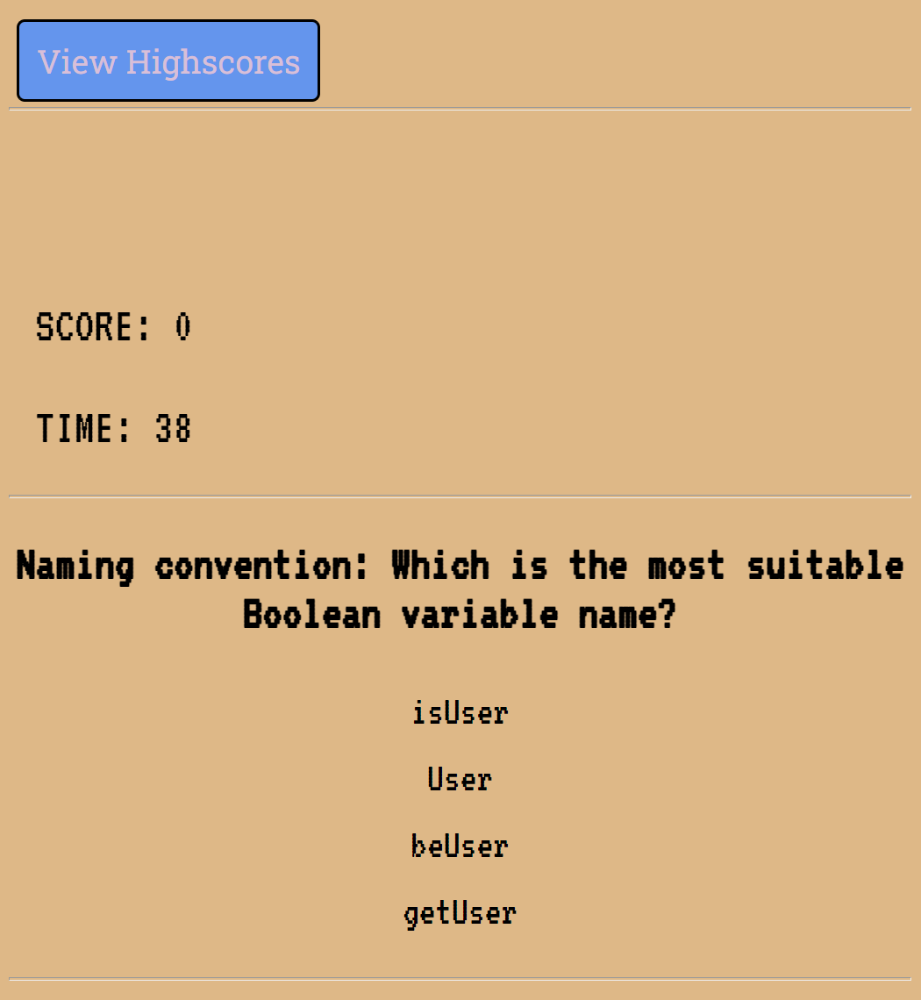

# Code Quiz - Bootcamp challenge #6.

##  Code Quiz
Be prepared to fry your mind with the ultimate code quiz.

Featuring everything you've come to expect from a code-quiz and more:

  * A start button that when clicked a timer starts and the first question appears.
  * Questions contain buttons for each answer!
  * When an answer is clicked, the next question appears!
  * A severe time penalty for an incorrect answer!
  * The quiz should ends when all questions are answered or the timer reaches 0.
  * Score displayed and persistent Hi-Score table!
  * Fiendishly challenging questions.

## Deployment

### [repo](https://github.com/S-R-i-c-e/code-quiz)
### [webpage](https://s-r-i-c-e.github.io/code-quiz/)
javascript code, html rendering, CSS styling. 

## Installation
requires a web-browser - open index.html file.

## Screenshot

## Written by
Stephen Rice 15/01/2022

